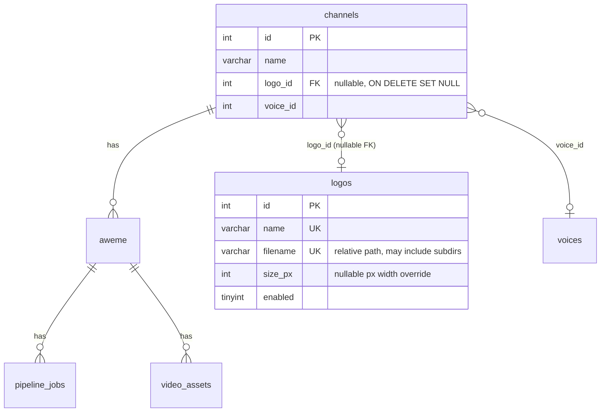

# Channel logo overlay configuration (originally Database V3)

> **Migration file note (Database V4):** the migration originally cited
> throughout this document, `docs/pipeline-migrate-channel-logo-v3.sql`,
> has been deleted - its `logos` table DDL is now owned by
> `docs/pipeline-migrate-channel-pipeline-config-v4.sql` (a byte-for-byte
> identical definition), per `docs/channel-pipeline-config-plan.md`'s
> migration-file consolidation policy. `channels.logo_id` (described below)
> still exists and is unchanged; a new, separate `channel_pipeline_configs.logo_id`
> column (plus a `logo_enabled` toggle) has been introduced alongside it -
> see `docs/channel-pipeline-config-plan.md` for the full design and
> current migration status. This document's description of `channels.logo_id`
> and the resolution flow below remains accurate for the legacy column
> during the transition period.

Design + operational reference for reusable, per-channel video overlay
logos. Builds on the schema in `docs/SRS-douyin-download-pipeline.md` and
the reusable-config pattern established by the former Database V2
migration (`voices` / `channels.voice_id`), but is deliberately simpler: a
logo is fully **optional** (a channel has zero or one), so there is no
per-aweme override and no system-default fallback logo the way voice
always resolves to *something*.

Migration (original): the now-deleted `docs/pipeline-migrate-channel-logo-v3.sql`;
its `logos` DDL is preserved verbatim in
`docs/pipeline-migrate-channel-pipeline-config-v4.sql`.
Code: `dub_worker/logo_resolver.py`, `dub_worker/db.py`, `dub_worker/runner.py`,
`dub_worker/worker.py`, `dub_worker/config.py`.

---

## 1. Current state before this change

- `render_subtitle_pipeline.py` ("Pipeline 2") already implements a complete
  logo-overlay ffmpeg stage: `--enable-logo` / `--logo-file` (required when
  enabled) / `--logo-size` (pixel width, nullable → per-layout default) /
  `--logo-position` / `--logo-margin` / `--logo-opacity`. Disabled by
  default. Supported extensions: `.png .jpg .jpeg .webp .bmp .tif .tiff`.
- `run_pipeline.py` ("Pipeline 1") has **no first-class logo flags** — it
  forwards everything to Pipeline 2 through its passthrough
  `--pipeline2-args "..."` string (`shlex.split()`).
- `dub_worker` only had a **static**, env-level passthrough
  (`DUB_WORKER_PIPELINE2_ARGS`) — nothing resolved a channel-specific logo
  from the database, and nothing was recorded per-job about which logo (if
  any) was used.

This feature adds the missing piece: a DB-driven, per-channel logo
selection, safely resolved to a physical file and forwarded through the
**existing** Pipeline 2 flags — no new pipeline code, no second overlay
implementation.

---

## 2. Schema

### 2.1 `logos` — reusable logo configuration

| Column | Type | Null | Description |
|---|---|---|---|
| `id` | INT | NO | PK, auto increment |
| `name` | VARCHAR(100) | NO | Operator-facing identity, unique |
| `filename` | VARCHAR(512) | NO | Path **relative** to `DUB_WORKER_LOGO_ROOT`, may include subdirectories (e.g. `binhvv/channel1_logo.png`); unique |
| `size_px` | INT | YES | Overrides `render_subtitle_pipeline.py --logo-size` (pixel width). `NULL` = no override, pipeline default applies |
| `enabled` | TINYINT(1) | NO | 1 = usable, 0 = disabled (soft-delete) |
| `description` | TEXT | YES | Free-form notes |
| `created_at` / `updated_at` | DATETIME | NO | |

Constraints: `UNIQUE(name)`, `UNIQUE(filename)`, `KEY(enabled)`,
`CHECK(size_px IS NULL OR size_px > 0)`.

### 2.2 `channels.logo_id` — channel-level optional logo selection

Nullable `INT`, indexed, with a real foreign key:

```sql
ALTER TABLE channels ADD COLUMN logo_id INT NULL AFTER voice_id;
ALTER TABLE channels ADD KEY idx_channels_logo_id (logo_id);
ALTER TABLE channels
    ADD CONSTRAINT fk_channels_logo
    FOREIGN KEY (logo_id) REFERENCES logos(id)
    ON DELETE SET NULL ON UPDATE CASCADE;
```

`NULL` (the default for every existing and new channel) means "no logo
overlay" — a normal, permanent, common state, not a misconfiguration.

### 2.3 ER diagram



---

## 3. Design decision: Option A (nullable FK on `channels`)

Three options were compared, per the task brief:

| Option | Shape | Verdict |
|---|---|---|
| **A. Nullable FK** | `logos` + `channels.logo_id` | **Chosen** |
| B. Separate assignment table | `logos` + `channel_logo_assignments` | Rejected — over-engineered for this requirement |
| C. Filename directly on `channels` | `channels.logo_filename` | Rejected — not reusable, no soft-disable, no referential integrity |

**Why A over C:** a bare `channels.logo_filename` column can't be reused
across channels without copy-pasting the same string (and copy-pasting the
same size/description if those are ever added), can't be disabled globally
without an `UPDATE ... WHERE logo_filename = ...` scan across every
channel, and gives the database nothing to enforce — a typo'd filename is
only ever caught at render time. `logos` + `channels.logo_id` gets reuse,
one place to disable a logo (`logos.enabled = 0`), and a real FK for
referential integrity, at the cost of one extra table and one extra join.

**Why A over B:** a `channel_logo_assignments` table (channel_id, logo_id,
plus perhaps `assigned_at`) would make sense if a channel could hold
**multiple simultaneous** logo assignments (e.g. time-boxed campaigns,
future/past assignments coexisting) or if the assignment itself needed its
own metadata. Neither is true here — the requirement is explicitly "a
channel may optionally select **one** logo." A many-to-many join table adds
a second table, a second join, and an extra uniqueness rule ("at most one
active assignment per channel") to enforce something a single nullable
column already guarantees for free. If a future requirement needs
scheduled/historical assignments, promoting to option B at that point is a
mechanical migration (`channel_logo_assignments` can even be backfilled
directly from `channels.logo_id`) — but building it now would be
speculative.

**Why a real FK here, unlike `voices`:** the former Database V2 migration
deliberately skipped a FK on `channels.voice_id`/`aweme.voice_id`, "by
request," because voice resolution always needs *some* value (there's a
hardcoded last-resort fallback), so an unconstrained value plus
application-level validation was an acceptable, requested tradeoff. Logo
has no such fallback need — it's zero-or-one, end of story — so there's
nothing lost, and real referential integrity gained, by using an actual
`FOREIGN KEY ... ON DELETE SET NULL`.

**Is `logos.filename` UNIQUE the right call?** Yes here: unlike
`voices.filename` (deliberately non-unique, because different WPS pacing
*presets* of the same audio file are a real, existing need), a logo's only
per-row metadata today is `size_px`, and there's no documented need yet for
two database rows pointing at the same physical image with different
settings. If that need arises later (e.g. two independent size/position
presets of one image), drop the `UNIQUE(filename)` constraint at that
point — don't build for it speculatively now.

---

## 4. Logo resolution flow


Applied only when **all** of the following hold — otherwise the job
proceeds with no logo overlay, never failed:

```
video belongs to a channel (channel_id is not NULL)
  AND channel.logo_id is not NULL
  AND the logos row exists
  AND logos.enabled = 1
  AND filename is non-empty and passes path-safety validation
  AND the resolved file exists, is a regular file, is non-empty, is readable
  AND the file extension is one of .png/.jpg/.jpeg/.webp/.bmp/.tif/.tiff
```

Each failed condition is logged with a specific `skip_reason` (see §7) and
resolution simply continues to "no logo" — see
`dub_worker/logo_resolver.resolve_logo_for_channel`.

---

## 5. Path security

`logos.filename` is **only ever** a path relative to `DUB_WORKER_LOGO_ROOT`
— never trusted as an absolute path, and never joined onto anything else.
Resolution (`logo_resolver.validate_relative_filename`):

1. Reject empty/blank values.
2. Reject any value starting with `/` or `\` (POSIX/Windows absolute path)
   or matching a drive-letter prefix (`C:...`) — checked **before** any
   join, since `Path(root) / "/abs/path"` would otherwise silently discard
   `root` entirely (`pathlib`'s own join semantics).
3. Join onto `logo_root.resolve()`, then `.resolve()` the result (normalizes
   `..` segments and symlinks).
4. Verify the resolved path is still inside `logo_root` via
   `resolved.relative_to(logo_root)` — raises if it escaped.
5. Only then check the filesystem: exists, is a regular file, non-empty,
   readable, extension in the supported set.

| Input | Result |
|---|---|
| `channel_logo.png` | ✅ resolves to `<LOGO_ROOT>/channel_logo.png` |
| `binhvv/channel1_logo.png` | ✅ resolves to `<LOGO_ROOT>/binhvv/channel1_logo.png` |
| `brands/golf/logo.webp` | ✅ resolves to `<LOGO_ROOT>/brands/golf/logo.webp` |
| `../secret.png` | ❌ rejected — escapes root |
| `binhvv/../../../secret.png` | ❌ rejected — escapes root after normalization |
| `/app/logo/channel_logo.png` | ❌ rejected — absolute path |
| `/logo/channel_logo.png` | ❌ rejected — absolute path |
| `C:\logo\channel_logo.png` | ❌ rejected — Windows absolute path |

All rejections are non-fatal: the job proceeds without a logo, with a
warning logged and `skip_reason="invalid_relative_path"` recorded.

---

## 6. Environment configuration

```
DUB_WORKER_LOGO_ROOT=/app/logo
```

- Unset (default): logo overlay is disabled for every job — resolution
  always returns `skip_reason="logo_root_not_configured"` whenever a
  channel actually has a `logo_id` set; channels with no logo selected are
  unaffected either way.
- `dub_worker.config.Config.validate_logo_root()` logs (never raises) at
  worker startup (`run_forever`) whether the configured root exists and is
  a directory — a missing root fails closed per-job, never crashes the
  worker.
- **Local/WSL dev:** this repo has its own `logo/` directory at the repo
  root (mirroring `voices/`'s existing convention), e.g.
  `logo/binh/brian_on_the_go.png` (seeded by `docs/logos-seed-data.sql` as
  `filename = 'binh/brian_on_the_go.png'`). Point `DUB_WORKER_LOGO_ROOT` at
  its absolute path for local runs, e.g.
  `DUB_WORKER_LOGO_ROOT=/mnt/d/1.Personal/Project/Git/dubbing/logo` under
  WSL. Unlike `voices/` (resolved internally via `__file__` by
  `generate_segments.py`, no env var involved), logo resolution is
  deliberately always env-configured — per the task brief, the root must
  never be hardcoded into application code, since deployments may mount it
  anywhere (`/app/logo`, `/logo`, etc.).
- **Docker/deployment note:** mount whatever directory physically holds the
  logo files into the worker's container/host path and point
  `DUB_WORKER_LOGO_ROOT` at that mount, e.g.
  `-v /srv/logos:/app/logo -e DUB_WORKER_LOGO_ROOT=/app/logo`. There is no
  `docker-compose.yml` in this repo today (the worker runs as a plain
  process per `dub_worker/README.md`'s WSL setup) — this is guidance for
  whichever deployment eventually containerizes it.

---

## 7. Worker integration

`worker._handle_job` resolves the channel's logo in the same short-lived,
read-only connection phase as voice resolution (`fetch_aweme_context` /
`voice_resolver.resolve_voice_for_aweme`) — no extra DB round trip:

```python
resolved_logo = logo_resolver.resolve_logo_for_channel(conn, channel_id, config.logo_root)
```

This **always** returns a `ResolvedLogo` (never raises for a bad
config) with either `applied=True` + a validated `resolved_path`, or
`applied=False` + a `skip_reason`:

| `skip_reason` | Meaning |
|---|---|
| `no_channel` | job's aweme has no `channel_id` |
| `logo_disabled_by_channel_config` *(Database V4)* | `channel_pipeline_configs.logo_enabled = 0` for this channel - an independent kill-switch, distinct from `logo_id` itself being unset or `logos.enabled` below. See `docs/channel-pipeline-config.md`. |
| `no_logo_selected` | `channels.logo_id` (or, since Database V4, `channel_pipeline_configs.logo_id`) `IS NULL` (the common case) |
| `logo_record_missing` | `logo_id` points at a row that no longer exists |
| `logo_disabled` | `logos.enabled = 0` (disables the logo *catalog row* globally, for every channel using it) |
| `invalid_relative_path` | empty filename, or failed path-safety validation |
| `logo_root_not_configured` | `DUB_WORKER_LOGO_ROOT` unset |
| `file_missing` / `file_empty` / `file_unreadable` | filesystem check failed |
| `unsupported_extension` | not one of `.png/.jpg/.jpeg/.webp/.bmp/.tif/.tiff` |
| `schema_not_present` | database predates the former Database V3 migration (`logos` DDL now in `pipeline-migrate-channel-pipeline-config-v4.sql`) |

`resolved_logo.size_px` is only set when `logos.size_px` was both non-NULL
and valid (`1 <= n <= 4000`); an invalid override (e.g. negative, zero, or
out of range) is logged as a warning and **ignored** — the logo is still
applied, just without a `--logo-size` override, so the pipeline's own
default takes over. The optional size override is never itself a reason to
skip the whole logo.

The resolved logo is logged (`logo_resolver.log_resolved_logo`) right
before the subprocess starts, then passed into
`runner.build_run_pipeline_argv(..., resolved_logo=resolved_logo)`, and
finally recorded into `pipeline_jobs.result_json["logo"]`
(`logo_resolver.logo_to_result_dict`).

### Retries / reproducibility

Like voice, logo is **re-resolved fresh on every attempt** — never cached
across retries. A channel's logo assignment can change between attempt 1
and attempt 2 of the same job; the *next* claim picks up the new
assignment. A currently-running subprocess is unaffected mid-run (its argv
was already fixed at launch). What was actually used is preserved
afterward in `result_json["logo"]`, independent of later `logos`/`channels`
edits. The worker's claim query (`db.claim_next_dub_job`) and
`attempt_count` semantics are completely untouched by this feature.

---

## 8. Pipeline integration

`runner.build_run_pipeline_argv` only ever adds flags when
`resolved_logo.applied` is `True` — otherwise Pipeline 2's `overlay_logo`
step stays disabled exactly as before this feature existed. It reuses the
**existing** `render_subtitle_pipeline.py` flags, appended onto the same
`--pipeline2-args` string the static `DUB_WORKER_PIPELINE2_ARGS`/
`DUB_WORKER_RENDER_OUTPUT_SUFFIX` config already builds — logo flags are
appended **last**, so a per-channel assignment is never silently
overridden by a static passthrough value:

```
--enable-logo --logo-file <resolved_absolute_path> [--logo-size <n>]
```

- `--logo-file` is always the **absolute, resolved** path — never the bare
  relative `logos.filename` — and is `shlex.quote()`-escaped, since the
  whole `--pipeline2-args` string is re-split by `run_pipeline.py`'s own
  `shlex.split()` before being forwarded a second time to
  `render_subtitle_pipeline.py`.
- `--logo-size` is included **only** when `resolved_logo.size_px is not
  None` — a `None` never becomes a fabricated `0`/empty-string stand-in;
  omitting the flag entirely is what lets `render_subtitle_pipeline.py`'s
  own per-layout default keep applying.
- No new pipeline code was written and no second logo-overlay
  implementation was introduced — `render_subtitle_pipeline.py`'s
  `overlay_logo` step, `LogoConfig`, and `build_logo_filter` are reused
  completely unchanged.

---

## 9. `result_json["logo"]`

```json
{
  "logo": {
    "logo_id": 123,
    "name": "Channel 1 Logo",
    "filename": "binhvv/channel1_logo.png",
    "size_px": 160,
    "size_source": "database",
    "resolved_path": "/app/logo/binhvv/channel1_logo.png",
    "applied": true,
    "skip_reason": null
  }
}
```

When no logo is applied:

```json
{
  "logo": {
    "logo_id": null,
    "name": null,
    "filename": null,
    "size_px": null,
    "size_source": null,
    "resolved_path": null,
    "applied": false,
    "skip_reason": "no_logo_selected"
  }
}
```

**Note on `resolved_path`:** this repo's existing convention already stores
absolute filesystem paths in `pipeline_jobs.result_json`/`video_assets`
(e.g. `dubbed_mp4`'s `file_path`, `expected_final_output`), so
`resolved_path` is included here for consistency and operational
debuggability. `result_json` is not exposed through any public/external API
in this codebase today. **If it ever becomes externally visible**, trim the
logo payload to the safe subset the task brief calls out —
`logo_id`, `filename`, `applied`, `skip_reason` — and drop `resolved_path`
(a system filesystem path) and `name`/`size_px`/`size_source` at that point.

---

## 10. Administration

`docs/logos-seed-data.sql` seeds one real row already, for the one physical
file that exists in this repo today (`logo/binh/brian_on_the_go.png` ->
`filename = 'binh/brian_on_the_go.png'`) — run it right after the migration,
same convention as `docs/voices-seed-data.sql`. The examples below are for
adding further logos as more physical files are added under `logo/`.

**Insert a logo:**

```sql
INSERT INTO logos (name, filename, enabled, description)
VALUES ('Channel 1 Logo', 'binhvv/channel1_logo.png', 1, 'Primary brand mark for channel 1');
```

With an explicit size override:

```sql
INSERT INTO logos (name, filename, size_px, enabled)
VALUES ('Channel 1 Logo (compact)', 'binhvv/channel1_logo.png', 96, 1);
```

**Assign a logo to a channel:**

```sql
UPDATE channels SET logo_id = (SELECT id FROM logos WHERE name = 'Channel 1 Logo') WHERE id = 1;
```

**Remove a channel's logo:**

```sql
UPDATE channels SET logo_id = NULL WHERE id = 1;
```

**Disable a logo globally** (every channel using it falls back to "no
logo" on their next resolution, without touching any channel row):

```sql
UPDATE logos SET enabled = 0 WHERE id = 5;
```

**Replace the physical file, keeping the same DB record:** safe in
general — the worker resolves and validates the file fresh on every job
attempt (never caches file bytes or a stat across attempts), so a new file
at the same relative path is picked up by the next job that resolves it.

The one caveat is a **currently-running render**: `run_pipeline.py` passes
the resolved logo path to `render_subtitle_pipeline.py`, which opens/reads
that file as an `ffmpeg` input at the moment the `overlay_logo` filter
stage executes (image assumed static for the run's duration via `-loop 1`).
Replacing the file mid-render on a filesystem that supports atomic
replace-by-rename (`mv new.png old.png` on POSIX) is safe — `ffmpeg` keeps
its open file handle to the old inode. An **in-place overwrite** (writing
directly into the existing file, truncating first) is not guaranteed safe
and could produce a corrupted/partial frame if it races the read. Prefer
atomic replace for any logo file that might be referenced by an in-flight
job.

**Prefer `enabled = 0` over deleting a `logos` row.** Deletion is
supported (`ON DELETE SET NULL` cleanly clears any channel pointing at it),
but disabling preserves the historical record and avoids a channel
silently losing its logo assignment with no trace of what it used to be.

---

## 11. Migration

**Historical note:** the steps below describe the original, now-deleted
`docs/pipeline-migrate-channel-logo-v3.sql`. Its `logos` DDL (step 1) is
preserved verbatim in `docs/pipeline-migrate-channel-pipeline-config-v4.sql`.
Steps 2-3 (`channels.logo_id` itself) already ran against any database that
previously applied v3 and are not re-run - `channels.logo_id` is left
untouched by v4 (see `docs/channel-pipeline-config-plan.md` D13).

1. `CREATE TABLE IF NOT EXISTS logos` (idempotent on its own).
2. `ALTER TABLE channels ADD COLUMN logo_id INT NULL` (plain ALTER, not
   idempotent — same convention as `channels.voice_id` in v2 — running
   the script twice fails with a duplicate-column error).
3. Index + real FK (`ON DELETE SET NULL ON UPDATE CASCADE`) on
   `channels.logo_id`.

Run `docs/logos-seed-data.sql` immediately after (own file, same convention
as `docs/voices-seed-data.sql`) to seed the one physical logo file that
already exists under `logo/` in this repo.

Effects on existing data: every existing channel row is untouched except
gaining `logo_id = NULL` — zero behavior change immediately after
migrating. No existing job, asset, or channel row is modified or deleted.
Manual rollback SQL is included in the migration file's trailing comment
(not auto-executed).

Backward compatibility: `logo_resolver.resolve_logo_for_channel` itself
tolerates an un-migrated database (catches MySQL error codes 1054/1146 —
"unknown column"/"no such table" — exactly like `voice_resolver.py` does
for `voices`) and returns `skip_reason="schema_not_present"` rather than
raising. The worker's claim query and retry/attempt-count semantics are
entirely unaffected by this feature — nothing in `db.claim_next_dub_job`,
`db.mark_dub_failed`, or the reaper sweeps changed.

---

## 12. Failure-mode summary

| Scenario | Outcome |
|---|---|
| `channel_pipeline_configs.logo_enabled = 0` *(Database V4)* | Proceeds with no logo (`skip_reason="logo_disabled_by_channel_config"`), independent of `logo_id` |
| Channel has no `logo_id` | Proceeds with no logo (`skip_reason="no_logo_selected"`) |
| `logo_id` references a deleted/nonexistent row | Proceeds with no logo, warning logged |
| Logo `enabled = 0` | Proceeds with no logo, info logged |
| `filename` invalid or path-traversal attempt | Proceeds with no logo, **warning** logged (not silently ignored) |
| File missing / empty / unreadable / unsupported extension | Proceeds with no logo, warning logged |
| `DUB_WORKER_LOGO_ROOT` unset while a channel has a logo configured | Proceeds with no logo, warning logged |
| `size_px` invalid | Logo still applied, override ignored, warning logged |
| Everything valid | Logo overlay enabled, resolved absolute path + optional size forwarded |

**A missing/invalid logo NEVER fails the dub job** — this remains a
non-fatal, optional rendering feature, per the task brief. Every skip is
logged at `warning` (misconfiguration signals: missing record, disabled,
invalid path, missing file, invalid size) or `info` (expected/benign: no
channel, no logo selected, schema not migrated) level, and is always
captured in `result_json["logo"]["skip_reason"]` for auditability — never
silently dropped.

---

## 13. What's tested vs. manually verified

Automated (`dub_worker/tests/test_logo_resolver.py`,
`dub_worker/tests/test_runner_logo_argv.py`, stdlib `unittest`, no DB/ffmpeg
required — run with `python -m unittest discover dub_worker/tests -v`):

- Path safety: nested paths resolve, traversal (`../`, deeply-nested `../../../`)
  rejected, absolute POSIX/Windows paths rejected, empty filename rejected.
- File validation: missing/empty/unsupported-extension files rejected;
  valid nested files accepted.
- Size validation: `NULL`/valid/invalid (zero, negative, too large,
  non-numeric) values.
- Full `resolve_logo_for_channel` priority chain against a mocked DB layer:
  no channel, no logo selected, missing logo record, disabled logo, missing
  physical file, unconfigured root, valid logo (with/without size
  override), invalid size override still applies the logo, un-migrated
  schema (MySQL error 1054) is caught and treated as a skip (not raised),
  and an unrelated DB error still propagates.
- `runner.build_run_pipeline_argv`'s logo argv wiring: omitted when no
  logo/skip, `--logo-size` included only when a valid override exists,
  static `DUB_WORKER_PIPELINE2_ARGS`/`--output-suffix` composition, and a
  path containing spaces surviving the double `shlex` round-trip
  (`dub_worker` → `run_pipeline.py`'s own re-split → `render_subtitle_pipeline.py`).

**Not exercised by automated tests in this change** (consistent with this
project's existing convention — see `dub_worker/README.md`'s own "What has
and hasn't been verified" section, which documents the voice feature the
same way): the actual FK/unique constraints against a real MySQL instance,
the worker's end-to-end claim → resolve → subprocess → finalize lifecycle
with a real database, and a real `ffmpeg` render actually producing a
logo-visible output frame. These require a running MySQL + real image/video
fixtures this environment doesn't have provisioned; recommended manual
verification steps:

1. Apply `docs/pipeline-migrate-channel-pipeline-config-v4.sql` against a
   throwaway MySQL database (same Docker setup as `dub_worker/README.md`)
   - it now owns the `logos` table DDL previously in the deleted v3 file.
2. `INSERT` a `logos` row and assign it to a test channel per §10; run
   `python -m dub_worker.main worker --once` against a job for that
   channel's aweme with `DUB_WORKER_LOGO_ROOT` pointed at a directory
   containing the referenced file; confirm `--enable-logo --logo-file ...`
   appears in the logged subprocess argv and the rendered output actually
   shows the logo.
3. Repeat with `logo_id = NULL`, a disabled logo, and a `logo_id` pointing
   at a deleted row — confirm the job still reaches `success` with no logo
   and the corresponding `skip_reason` in `result_json`.
4. Attempt an invalid `filename` (`../secret.png`) directly via `UPDATE
   logos SET filename = '../secret.png' WHERE id = ...` and confirm
   resolution rejects it and the job still succeeds without a logo.

---

## 14. Remaining limitations

- No per-aweme logo override (channel-level only) — not required by the
  current brief; would mirror `aweme.voice_id` if ever needed.
- `logos.filename` uniqueness means two distinct size/position presets of
  the same physical image require two copies of the file today (see §3);
  revisit if that becomes a real need.
- Position/margin/opacity remain global pipeline defaults
  (`--logo-position`/`--logo-margin`/`--logo-opacity`), not per-logo or
  per-channel columns — out of scope per the brief's "prefer minimal scope"
  guidance; add a column the same way `size_px` was added if a real need
  arises.
- No automated test exercises the real FK constraint, the real
  `ON DELETE SET NULL` behavior, or an actual ffmpeg render against a live
  database — see §13's manual verification checklist.
- No `docker-compose.yml`/container manifest exists in this repo to update
  with a logo volume mount; §6's Docker guidance is written for whichever
  deployment eventually containerizes the worker.
