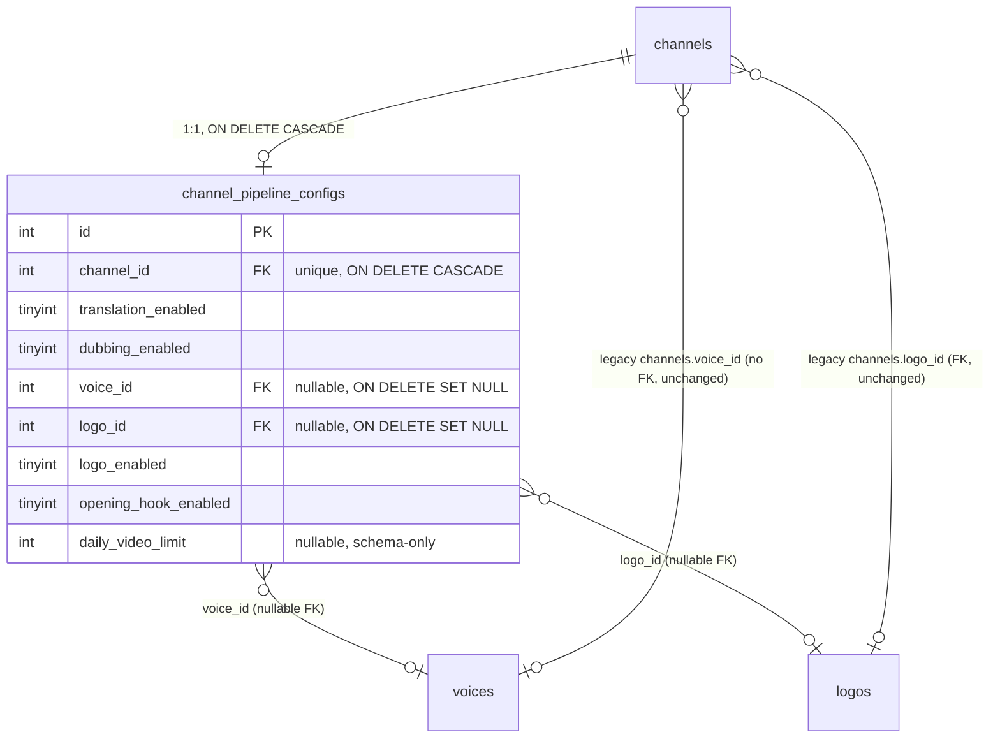
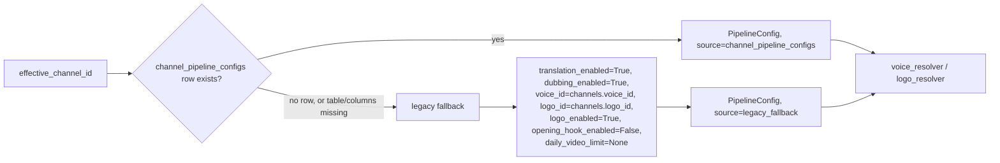

# Per-channel pipeline configuration (Database V4)

Design + operational reference for `channel_pipeline_configs`, the
single per-channel table controlling whether a channel's videos are
translated, dubbed, logo/opening-hook-overlaid, and (schema-only for now)
a daily processing limit. Builds on and consolidates the reusable-config
patterns established by the former Database V2 (`voices`) and Database V3
(`logos`) migrations.

Planning document (full findings, phased rollout, open decisions):
`docs/channel-pipeline-config-plan.md`.
Migration: `docs/pipeline-migrate-channel-pipeline-config-v4.sql` (also
now owns the `voices`/`logos` catalog DDL formerly in the deleted
`pipeline-migrate-voice-config-v2.sql`/`pipeline-migrate-channel-logo-v3.sql`).
Preflight: `docs/pipeline-preflight-channel-pipeline-config-v4.sql`.
Verification: `docs/pipeline-verify-channel-pipeline-config-v4.sql`.
Code: `dub_worker/pipeline_config.py`, `dub_worker/db.py`,
`dub_worker/voice_resolver.py`, `dub_worker/logo_resolver.py`,
`dub_worker/worker.py`.

---

## 1. What this feature covers (and what it doesn't, yet)

**Covered by this implementation (Phase 1 + Phase 2 of the plan):**

- Schema: `channel_pipeline_configs` exists, one row per channel, with
  `translation_enabled`, `dubbing_enabled`, `voice_id`, `logo_id`,
  `logo_enabled`, `opening_hook_enabled`, `daily_video_limit`.
- Every existing channel is backfilled with the exact "full pipeline,
  nothing new" defaults - zero behavior change immediately after
  migrating.
- `dub_worker`'s runtime **reads** this table (via
  `pipeline_config.resolve_pipeline_config`) and uses its
  `voice_id`/`logo_id`/`logo_enabled` values in place of the legacy
  `channels.voice_id`/`channels.logo_id` columns, when a row exists.
- A single, effective-channel resolution step (see §4) reconciles
  `pipeline_jobs.channel_id` vs. `aweme.channel_id`.

**NOT yet covered (deferred to Phase 3, explicitly out of scope here):**

- `translation_enabled`/`dubbing_enabled` do **not** yet change which
  `run_pipeline.py` steps actually run - the worker always runs the full
  pipeline today, regardless of what a channel's config row says. Two
  concrete `run_pipeline.py` orchestration gaps must be fixed first (see
  `docs/channel-pipeline-config-plan.md` §9, D9/D10).
- `daily_video_limit` is **schema-only** - nothing in `dub_worker` reads
  or enforces it yet. Several semantics (timezone, which event counts,
  whether combo-3 videos consume quota) remain open decisions (see the
  plan's §6, D3-D6, D12).
- `opening_hook_enabled` has no consuming code yet either - it's stored,
  not acted on.

---

## 2. Schema

### 2.1 `channel_pipeline_configs`

| Column | Type | Null | Default | Description |
|---|---|---|---|---|
| `id` | INT | NO | auto | PK |
| `channel_id` | INT | NO | — | FK → `channels.id`, `ON DELETE CASCADE`. Unique - enforces the 1:1 relationship. |
| `translation_enabled` | TINYINT(1) | NO | 1 | ASR + translate + Vietnamese subtitle generation |
| `dubbing_enabled` | TINYINT(1) | NO | 1 | TTS + dub audio. Requires `translation_enabled=1` (see §3) |
| `voice_id` | INT | YES | NULL | FK → `voices.id`, `ON DELETE SET NULL`. `NULL` = use the system-default voice |
| `logo_id` | INT | YES | NULL | FK → `logos.id`, `ON DELETE SET NULL`. `NULL` = no logo |
| `logo_enabled` | TINYINT(1) | NO | 1 | Independent kill-switch, distinct from `logo_id` being set |
| `opening_hook_enabled` | TINYINT(1) | NO | 0 | Off everywhere today; matches current universal behavior |
| `daily_video_limit` | INT | YES | NULL | `NULL`=unlimited (schema-only for now - see §1) |
| `created_at` / `updated_at` | DATETIME | NO | — | |

Constraints: `UNIQUE(channel_id)`, `CHECK(translation_enabled=1 OR
dubbing_enabled=0)`, `CHECK(`all four flags `IN (0,1)`)`,
`CHECK(daily_video_limit IS NULL OR daily_video_limit >= 0)`, three FKs
(see table above for `ON DELETE` rules).

### 2.2 Why `voice_id`/`logo_id` moved here, not deleted from `channels`

`channels.voice_id`/`channels.logo_id` (the legacy columns from the former
Database V2/V3 migrations) are **left untouched** by this migration. They
remain the fallback source of truth for any channel that doesn't yet have
a `channel_pipeline_configs` row (see §5, the dual-read/legacy-fallback
contract). Dropping them is deferred to a later, separate migration once
this feature's runtime adoption has shipped and been verified (D13 in the
plan) - never in the same migration that introduces the new table.

### 2.3 `aweme.voice_id` — restored, final semantics

The former Database V2 migration (now deleted) created
`aweme.voice_id INT NOT NULL DEFAULT 1`, which made every video row take
the per-video-override branch below regardless of intent, since a value
was always present. Database V4 restores the column's intended
definition - `INT NULL DEFAULT NULL` - state-aware for both installation
paths (see §6):

- `aweme.voice_id IS NULL` -> no per-video override -> fall through to
  `channel_pipeline_configs.voice_id` (or the legacy `channels.voice_id`
  fallback), then the system-default voice (`voices.is_default=1`).
- `aweme.voice_id IS NOT NULL` -> explicit per-video override, highest
  priority in `voice_resolver.py`'s resolution chain.

On an existing database that already ran the former V2 migration, v4
`ALTER`s the column to nullable/`DEFAULT NULL` but **leaves every existing
value unchanged**, including rows that only ever carried the old default
of `1` - the migration cannot tell "an operator deliberately chose voice 1"
apart from "nobody ever set this," so it never auto-converts `voice_id=1`
rows to `NULL`. `docs/pipeline-preflight-channel-pipeline-config-v4.sql`
and `docs/pipeline-verify-channel-pipeline-config-v4.sql` both include a
`SELECT COUNT(*) FROM aweme WHERE voice_id = 1` report so this population
stays visible for a separate, later review - not silently reinterpreted
here. See `dub_worker/voice_resolver.py`'s module docstring and
`dub_worker/tests/test_voice_resolver.py` for the resolution-order tests.

### 2.4 ER diagram



---

## 3. Valid processing combinations

| # | translation | dubbing | Behavior |
|---|---|---|---|
| 1 | 1 | 1 | Translate, TTS, dub, Vietnamese subtitles, logo/opening-hook |
| 2 | 1 | 0 | Translate + Vietnamese subtitles, keep original audio, logo/opening-hook |
| 3 | 0 | 0 | Skip ASR/translate/TTS/subtitles entirely, keep original video+audio, still logo/opening-hook |
| 4 | 0 | 1 | **Invalid** - rejected by both the DB `CHECK` and `pipeline_config.validate_pipeline_config_combo` |

Enforcement is deliberately doubled: the `CHECK` constraint is the primary
guard, and `dub_worker/pipeline_config.py::validate_pipeline_config_combo`
duplicates it in application code, since CHECK enforcement is
MySQL-version-dependent and this repo has no admin API (every write to
this table today is manual SQL).

---

## 4. Effective-channel resolution

`pipeline_jobs.channel_id` is nullable, and `aweme.channel_id` is read
independently by `db.fetch_aweme_context`. Before resolving a pipeline
config, the worker computes:

```python
effective_channel_id = pipeline_config.resolve_effective_channel_id(
    job["channel_id"], context.get("channel_id"),
)
```

- Job's `channel_id` wins when both are present and agree.
- Falls back to `aweme.channel_id` when the job has none.
- **Raises `ValueError` if both are present and disagree** - `worker.py`
  treats this as a deterministic, terminal failure (never auto-retried;
  see `worker.py::_handle_job`'s `channel_mismatch_error` handling) rather
  than silently applying one channel's configuration to a different
  channel's video.

---

## 5. Resolution flow and the legacy-fallback contract

`dub_worker/pipeline_config.py::resolve_pipeline_config(conn,
effective_channel_id)` is the **single** call site for every field this
feature introduces - `worker.py` calls it once per job, in the same
read-only connection phase as voice/logo resolution.



**Never returns a partial object.** Whether a row exists or not, every one
of the seven fields is populated - the legacy-fallback path (§ above)
reads `channels.voice_id`/`channels.logo_id` directly (each independently
guarded against a MySQL 1054/1146 "unknown column/table" error, so a
partially-migrated database - e.g. `voice_id` present but `logo_id` not -
degrades gracefully on just the missing one) and synthesizes the rest from
the exact "full pipeline, nothing new" defaults every channel had before
this feature existed.

### Schema-error handling: 1146 vs. 1054 are NOT the same situation

When querying `channel_pipeline_configs` itself (not the legacy fallback
above), `resolve_pipeline_config` distinguishes two different MySQL
errors instead of treating every DB error as "not migrated yet":

- **1146** (`ER_NO_SUCH_TABLE`, the table doesn't exist) - a legitimate
  rollout-compatibility state; falls back to the legacy path.
- **1054** (`ER_BAD_FIELD_ERROR`, the table exists but a query against it
  is missing an expected column) - treated as an **incomplete or
  corrupted Database V4 schema**, never silently downgraded to the legacy
  fallback. Raises `pipeline_config.PipelineConfigError` with a message
  pointing at `docs/pipeline-verify-channel-pipeline-config-v4.sql` for
  diagnosis. Any other/unexpected DB error propagates unchanged - there is
  no broad exception handler that converts an unrecognized failure into a
  legacy fallback.

### Application-level validation on every loaded row

Every row read from `channel_pipeline_configs` is validated by
`pipeline_config.validate_pipeline_config_row()` **before** any field is
converted with `bool(...)` - a boolean column holding `2` (or `-1`, or
`NULL`) is rejected outright rather than silently coercing to `True`.
Validation also re-checks the translation/dubbing combination and rejects
a negative `daily_video_limit`, a non-positive `voice_id`/`logo_id`, and a
`channel_id` mismatch between the row and the caller's effective channel.
A failure raises `PipelineConfigError`.

`worker.py` catches `PipelineConfigError` (from either the schema-error or
the row-validation path above) and records it as a **terminal,
non-retryable** job failure with the error text persisted on the job -
without changing `pipeline_jobs`'s schema or lifecycle semantics, and
without ever starting the dubbing subprocess against an invalid
configuration.

### Integration with `voice_resolver.py`/`logo_resolver.py`

Both resolvers gained an **optional, additive** `pipeline_config`
parameter:

```python
voice_resolver.resolve_voice_for_aweme(conn, aweme_id, channel_id, pipeline_config=resolved_pipeline_config)
logo_resolver.resolve_logo_for_channel(conn, channel_id, logo_root, pipeline_config=resolved_pipeline_config)
```

When given, `voice_resolver`'s channel-level-override step (priority 2 of
its aweme → channel → default → hardcoded-fallback chain) and
`logo_resolver`'s sole channel lookup use `pipeline_config.voice_id`/
`pipeline_config.logo_id` directly instead of issuing their own
`channels`-scoped query - avoiding a redundant round trip, since
`worker.py` already resolved it once. **When omitted (the default),
behavior is completely unchanged from before this feature existed** -
this is what keeps every pre-existing call site and test
(`dub_worker/tests/test_logo_resolver.py` in particular, which mocks
`db.fetch_channel_logo_id` directly) passing without modification.

`logo_resolver.resolve_logo_for_channel` additionally gains a new gate:
when `pipeline_config.logo_enabled` is `False`, resolution short-circuits
to `skip_reason="logo_disabled_by_channel_config"` - independent of
whether `logo_id` itself is set, and distinct from `logos.enabled=0`
(which disables the logo *catalog row* globally, not just for one
channel).

---

## 6. Migration

See `docs/channel-pipeline-config-plan.md` §4 for the full phased
rollout. `v4` never assumes which of the two states below it's running
against - every step is state-aware via `INFORMATION_SCHEMA`, not a
fixed assumption about what already exists:

- **State A - existing database that already ran the former, now-deleted
  v2/v3 migrations.** `channels.voice_id`/`logo_id`, `voices`, `logos`,
  and the legacy `aweme.voice_id NOT NULL DEFAULT 1` already exist. v4
  migrates the legacy channel-level selections into
  `channel_pipeline_configs` and `ALTER`s `aweme.voice_id` to nullable
  (see §2.3) without touching existing values.
- **State B - clean install: v1 followed directly by v4, v2/v3 never
  applied.** No legacy columns or `voices`/`logos` tables exist at all. v4
  creates `voices`/`logos` itself (the DDL formerly split across the now-
  deleted v2/v3 files) and `aweme.voice_id` as nullable/`DEFAULT NULL`
  from the start, then backfills every channel's config row with the
  "full pipeline, nothing new" defaults directly (no legacy values to
  migrate).

Order of operations, both states:

1. **Preflight** (`docs/pipeline-preflight-channel-pipeline-config-v4.sql`,
   run in EITHER state - it is fully state-aware, not State-A-only): in
   State A, detects any `channels.voice_id`/`logo_id` value that no longer
   references a real `voices`/`logos` row, reports legacy values that will
   be migrated, and reports the `aweme.voice_id = 1` population (§2.3); in
   State B, every one of those checks is guarded by an `INFORMATION_SCHEMA`
   existence check and returns an informational "check skipped - column
   not present" result instead of running at all - it never raises
   `Unknown column`, and it never requires the operator to expect, ignore,
   or treat any SQL error as normal. There is no "exclude the orphan
   channel from backfill" option - none is implemented; an orphan must be
   fixed before proceeding, and the preflight script itself also `SIGNAL`s
   a blocking error if it finds one (not just the migration).
2. **Migration** (`docs/pipeline-migrate-channel-pipeline-config-v4.sql`):
   creates/alters the required schema (branching per state above), then
   runs its own pre-backfill schema-and-data verification via a temporary
   stored procedure (`sp_v4_verify_before_backfill`, dropped again after
   use) that `SIGNAL`s a clear SQL error - column shape, nullability,
   defaults, FKs/deletion behavior, CHECK constraints, required indexes,
   and (State A) zero remaining orphan `voice_id`/`logo_id` references -
   **before** any row is backfilled, not after. Only then does it backfill
   one row per channel, still guarded by `WHERE NOT EXISTS` (never
   `INSERT IGNORE`), so an unremediated problem fails the whole statement
   loudly instead of silently dropping that channel's row.
3. **Verification** (`docs/pipeline-verify-channel-pipeline-config-v4.sql`):
   schema shape (columns, indexes, CHECKs, FKs, engine/charset), data
   parity (State A: legacy value vs. migrated value, row counts;
   `aweme.voice_id` nullability), and final reconciliation queries proving
   every channel has exactly one config row and no config row references a
   missing channel, voice, or logo (also the diagnostic for the item-8
   external-dependency gap below).
4. **Cleanup** (later, separate, not part of this change): drop
   `channels.voice_id`/`channels.logo_id` only once Phase 2's runtime
   adoption has been verified in production (D13 - deliberately still
   open, see the plan).

Idempotent and safe to re-run in both states: every `CREATE TABLE` uses
`IF NOT EXISTS`, and the backfill only inserts for channels that don't
already have a row.

### New channels: config-row creation is an external dependency

`channels` rows are created entirely by the separate Download Service
repository, not this one (confirmed by a repo-wide search for `INSERT INTO
channels`, which finds only this repo's own tests). This repo does not add
a local channel-creation path or a hidden database trigger. See
`docs/channel-pipeline-config-plan.md` §11/D8 for the full requirement:
the Download Service must insert the `channels` row and a default
`channel_pipeline_configs` row in the same transaction. Until that lands,
a channel missing a config row is detected by the verify script's
reconciliation query (step 3 above) and falls back through the same
legacy-fallback path as §5 - temporary rollout protection only, not the
permanent creation strategy.

---

## 7. Administration

Same manual-SQL convention as `voices`/`logos` (no admin API exists in
this repo):

```sql
-- Disable dubbing for a channel (keep translation + subtitles + logo/hook):
UPDATE channel_pipeline_configs SET dubbing_enabled = 0 WHERE channel_id = 1;

-- Skip everything upstream, keep original video/audio, still logo/hook:
UPDATE channel_pipeline_configs SET translation_enabled = 0, dubbing_enabled = 0 WHERE channel_id = 1;

-- Assign a channel-level default voice:
UPDATE channel_pipeline_configs
SET voice_id = (SELECT id FROM voices WHERE name = 'Manh Dung')
WHERE channel_id = 1;

-- Temporarily disable a channel's logo without clearing the assignment:
UPDATE channel_pipeline_configs SET logo_enabled = 0 WHERE channel_id = 1;
```

Rejected by the `CHECK` constraint (and by
`pipeline_config.validate_pipeline_config_combo` if going through
application code):

```sql
UPDATE channel_pipeline_configs SET translation_enabled = 0, dubbing_enabled = 1 WHERE channel_id = 1;
-- ERROR 3819 (HY000): Check constraint 'chk_channel_pipeline_configs_valid_combo' is violated.
```

---

## 8. What's tested vs. not yet verified

Automated, DB-free (`dub_worker/tests/test_pipeline_config.py`): combo
validation (all 4 combinations), effective-channel resolution (agreement,
one-sided, both-null, mismatch), the legacy-fallback contract for all
seven fields (including partial-schema and missing-schema degradation),
`resolve_pipeline_config`'s 1146-vs-1054 schema-error branching (§5) with
a mocked DB layer, and `validate_pipeline_config_row`'s full boundary set
(every non-boolean value, every invalid combo, negative/zero
`daily_video_limit`/`voice_id`/`logo_id`, `channel_id` mismatch).

Automated, DB-free (`dub_worker/tests/test_voice_resolver.py`): the
aweme -> channel -> default -> hardcoded-fallback resolution order at
every fall-through combination, and the additive `pipeline_config`
fast-path.

Automated, DB-free (`dub_worker/tests/test_worker_pipeline_config_failures.py`):
proves the EXISTING worker lifecycle already treats an invalid
`channel_pipeline_configs` row (or an incomplete Database V4 schema, MySQL
1054) as a terminal, non-retryable job failure - `runner.run_pipeline`
(the dubbing subprocess) is never invoked, `db.mark_dub_failed` is called
with `terminal=True`, and a clear configuration error is persisted; also
proves an ordinary transient DB/runtime failure and an operational
pipeline timeout remain retryable (`terminal=False`) under the same rules,
as the contrasting case.

Automated, DB-free (`dub_worker/tests/test_sql_runner.py`): proves the
integration suite's SQL-script executor correctly treats semicolons inside
`--`/`#`/`/* */` comments, quoted strings, and a `DELIMITER`-switched
stored-procedure body as NOT statement boundaries - the exact class of bug
a naive `text.split(";")` has.

Automated, real-MySQL, gated behind `DUB_WORKER_TEST_DB_*`
(`dub_worker/tests/test_db_pipeline_config_integration.py`), split into
isolated scenarios per §6's State A/State B distinction so no single test
run mixes contradictory assertions against one schema. **This suite has
been executed against a real MySQL 8.0 server** (see
`docs/channel-pipeline-config-plan.md`'s own verification report for the
exact command and result) - not merely written and statically inspected:

- `StateAMigrationTests` - legacy-upgrade assertions (legacy value
  migration, `aweme.voice_id` nullability/unchanged-values, orphan
  blocking on both the preflight script and the migration itself,
  idempotency, a full preflight→migrate→verify workflow) plus the
  state-agnostic schema-shape/FK/CHECK/cascade/`resolve_pipeline_config`
  tests.
- `StateBMigrationTests` - clean-install assertions (no dependency on the
  deleted v2/v3 files, backfill with no legacy columns, new `aweme` rows
  default to `voice_id=NULL`, a full preflight→migrate→verify workflow
  confirming the preflight script raises no `Unknown column` error in
  this state).
- `SchemaVerificationFailureTests` - adversarial: missing required column,
  incorrect nullability, incorrect default, an index with the correct name
  but the wrong column, a CHECK with the correct name but the wrong
  expression, a foreign key with an incorrect delete rule, a partial
  `voices` schema, a partial `logos` schema, and an incorrectly-defined
  `aweme.voice_id` each independently make the migration's own pre-backfill
  verification procedure abort loudly before any backfill.

Every migration/preflight/verify `.sql` file is executed through the real
`mysql` CLI (`dub_worker/tests/sql_runner.py`), never a hand-rolled
splitter.

**Database safety**: the suite creates and drops its own disposable,
randomly-named database for the whole run (`setUpModule`/`tearDownModule`)
- it never takes a destructive target database name from an environment
variable, so it cannot be pointed at `douyin_downloader` or any other
pre-existing database. To run this suite:

```
DUB_WORKER_TEST_DB_HOST=127.0.0.1
DUB_WORKER_TEST_DB_PORT=3306
DUB_WORKER_TEST_DB_USER=<a user with CREATE/DROP DATABASE privilege>
DUB_WORKER_TEST_DB_PASSWORD=...
python -m unittest dub_worker.tests.test_db_pipeline_config_integration -v
```

Missing `DUB_WORKER_TEST_DB_HOST` is an ordinary skip. A configured user
lacking `CREATE DATABASE` privilege is also a skip, with a precise reason -
never a fallback to resetting some other, shared database. See
`dub_worker/README.md` for the exact grant needed.

Not yet implemented/tested: anything from Phase 3 (translation/dubbing
actually changing pipeline execution, daily-limit enforcement,
opening-hook generation in no-translate mode) - see
`docs/channel-pipeline-config-plan.md` for what remains blocked and why.
